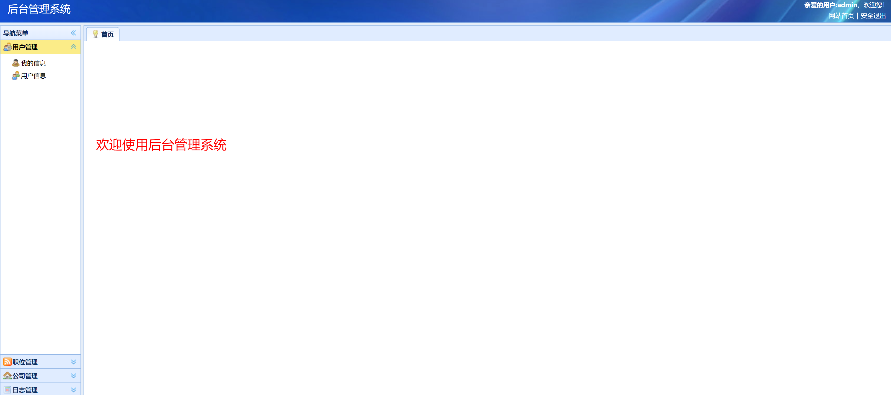

<h1 align="center">人才招聘管理系统</h1>

## 简介
人才招聘管理系统：角色分为管理员、用户；用户登录、简历管理、职位发布、面试安排、数据统计、后台管理、公司信息维护、招聘进度报告。    --计算机毕业设计源码；毕设源码；java毕业设计源码

## 联系方式

<h3 align="center">获取完整代码与数据库文件 + 微信：bysj5151 QQ: 86050149 QQ群: 783742310</h3>

<h3 align="center">可帮忙远程部署 包运行成功！提供远程部署、修改代码、设计文档指导、代码讲解等服务！</h3>

## 功能介绍（完整见运行截图）
用户： 登录界面提供邮箱、密码及验证码输入框；简历页面显示简历评分、基本信息、期望职位和修改功能；可通过二维码和微信查找职位并更新简历信息。

管理员： 通过后台管理界面访问用户管理、职位管理、公司管理和日志管理功能；可查看和修改公司信息，使用搜索和状态筛选，管理公司状态和记录。

招聘人员： 发布职位并设定要求和薪酬；管理简历筛选、面试安排及通知发送；生成招聘统计报告以分析和优化招聘策略。

访客： 浏览主页、公司信息、职位类别及详细职位信息；通过搜索栏查找职位。

## 运行截图

本代码来源于网络,仅供学习参考使用!

